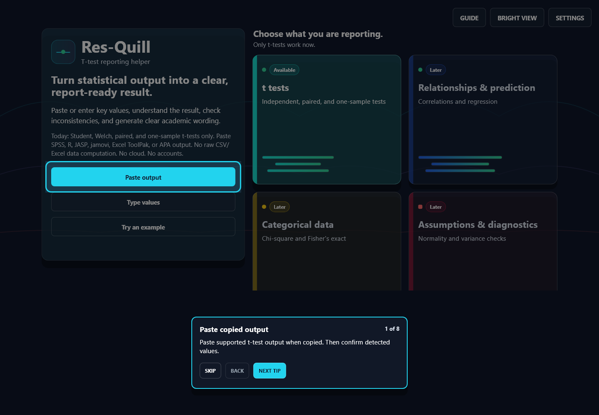
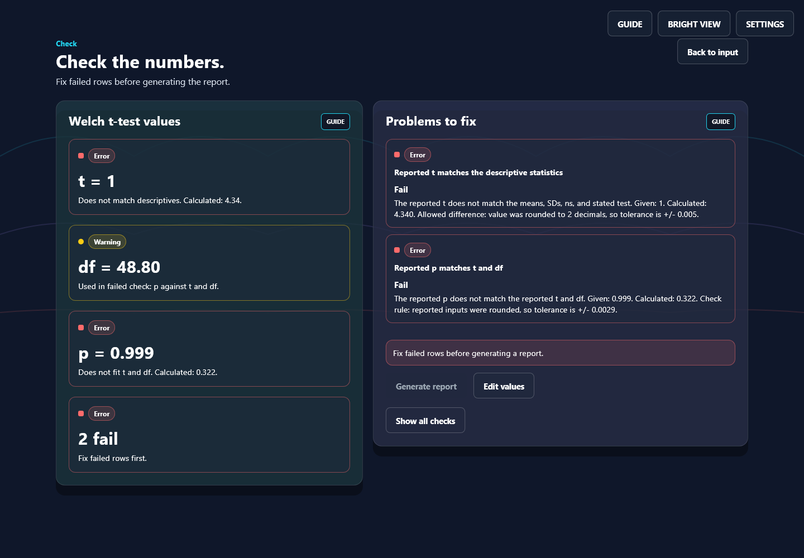

# Res-Quill

Turn statistical output into a clear, report-ready result.

Res-Quill takes t-test output you have already produced in SPSS, R, jamovi, JASP or Excel,
checks it for internal contradictions, and writes the reporting paragraph only when the
numbers hold together.

It is a work in progress. What is described below is wired end to end and reachable through
the UI; [what is not](#what-it-does-not-do) is listed just as plainly.



## What it does

**Reads output you paste.** SPSS tables, R `t.test()` console output, jamovi and JASP
tables, Excel Data Analysis ToolPak blocks, and APA-style sentences. Each value is extracted
as a separate field with the text it came from, so you can see what was read and correct it.

Anything it cannot read confidently is refused with a specific reason. A wrong silent parse
is worse than "I do not recognise this format".

**Checks the numbers against each other.** From the descriptives you entered, it recomputes
and compares:

| Check | What it catches |
| --- | --- |
| Value domains | An SD that is negative, a p outside 0-1, an impossible n |
| df against the selected test | A whole-number df reported for a Welch result, and similar |
| t against the descriptives | A t that does not follow from the means, SDs and ns |
| p against t and df | The most common transcription error |
| Each CI bound against the difference and SE | An interval that cannot come from these numbers |
| GRIM | A rounded mean that is not attainable at the stated n |

Checks carry a tolerance derived from how many decimals were actually reported, because real
output is rounded. Without that, a correct result near p = .05 is falsely rejected.

**Refuses to write a report over a contradiction.** A failing check disables report
generation and says what the value should have been. Nothing is silently corrected.

**Handles the p-value conventions.** A reported `.000` is read as `p < .001`, never as
`p = 0`. R's `p-value < 2.2e-16` is kept as a strict inequality. A result at p = .051 is
reported as p = .051 and described as not significant - no "marginally significant", no
"approaching significance", no "trend towards".



**Writes the report.** The APA paragraph, the descriptive statistics, effect size with the
small-sample correction and the Cohen (1988) benchmark, a separation of what may and may not
be inferred, and an evidence map linking every number in the prose back to the value it came
from.

**Tests implemented:** independent Student, independent Welch, paired samples, one sample.

## What it does not do

- **Only t-tests.** The other three areas on the home screen - relationships and prediction,
  categorical data, assumptions and diagnostics - are marked "Later" and have nothing behind
  them yet.
- **No raw data.** It does not read a CSV or a spreadsheet of observations and compute
  anything. It consumes output that already exists.
- **No accounts, no cloud, no saved history.** Everything is local to the session.
- **English only.** There is no localisation.
- **Android is unverified.** A debug APK builds, but it has never been run - there is no
  device or emulator on the development machine. Unknown, not "probably fine".

## Running it

Requires Flutter 3.41.6 or later.

```
flutter pub get
flutter run -d windows     # or: -d chrome
```

Tests:

```
flutter analyze
flutter test
```

## How it is verified

The statistics are the product, so the verification is deliberately independent of the code
that is being verified:

- Parser fixtures are built from documented output shapes, each marked as reproduced from a
  real source or synthesised, and every expected t, df and p is computed independently with
  scipy from that fixture's own descriptives - never from numbers typed into the fixture.
- A separate harness in `tool/verify/` runs the parser over a corpus its author never saw.
  That is what caught the parser accepting its own fixtures while failing on genuine R
  output, which does not print N or SD at all.
- The guide overlay is covered by a geometry test across 5 screens, 19 steps and 2 widths,
  asserting the tip card never overlaps a heading, a control, or its own target.
- UI defects are found by rendering the app and reading the screenshots, not by reading the
  code. `captures/` holds that trail.

`QA_SWEEP_2026-08-31_EN.md` records the current limits and the defects found and fixed,
including the ones that were mine.
